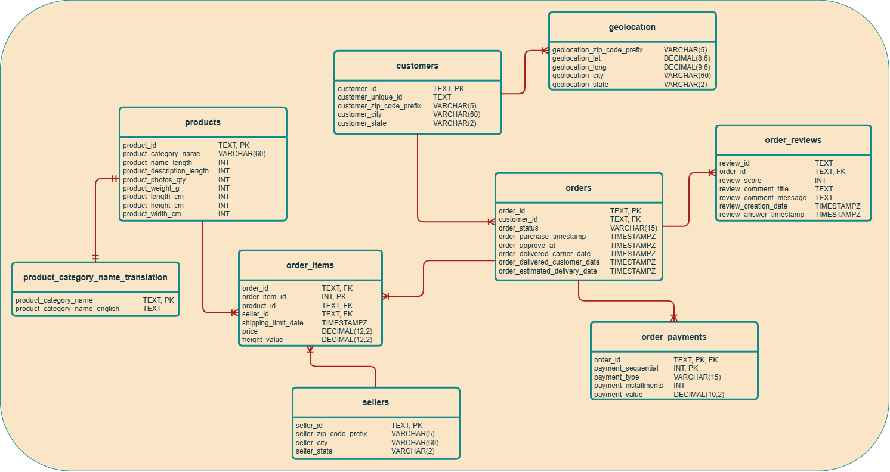

# Olist E-Commerce: Delivery Performance & Revenue Analysis

_Description_

---

## Business Problem:

> Customer satisfaction has been inconsistent and delivery performance may be one of the key factors affecting customer reviews. This analysis aims to understand how delivery times, seller performance and product categories relate to customer satisfaction, while also identifying where revenue is concentrated and which areas are growing.

## Objective:

Analyze order, delivery, payment and review data to identify what drives customer satisfaction and revenue performance across sellers, product categories and geographic regions and recommend where Olist should focus operational and commercial investment.

## Dataset:

- **Source:** Kaggle - Brazilian E-Commerce Public Dataset by Olist
- **Size:** ~100,000 orders, 2016-2018
- **Tables:** 9 (customers, orders, order payments, order reviews, products, product category translation, sellers, order items, geolocation)

### Database Schema

_A relational database connecting customers, orders, products, sellers, payments, and reviews for analyzing sales, delivery performance, and customer satisfaction._

## Key Findings:

## Recommendation:

## Repository Structure:

## About this Project:
